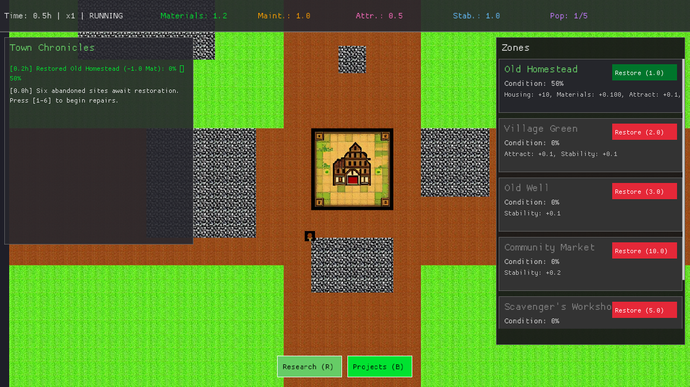
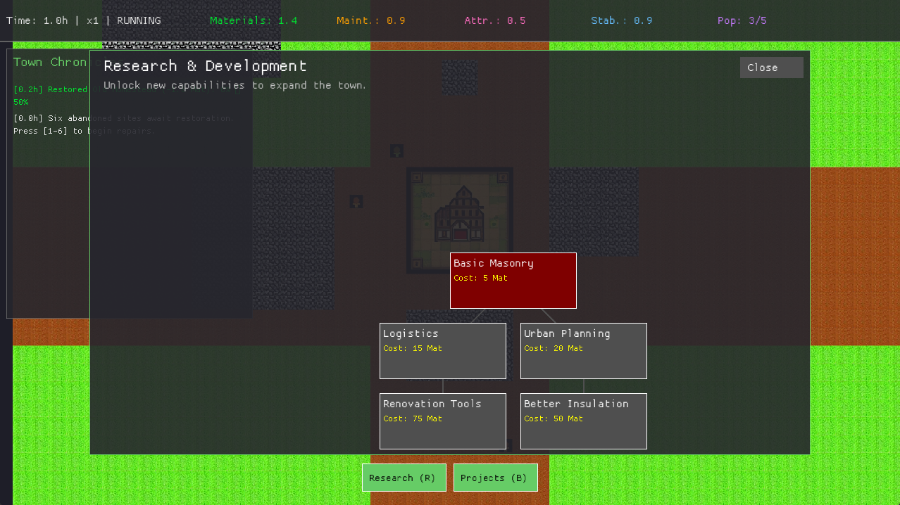
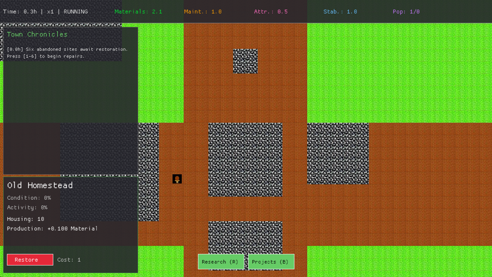
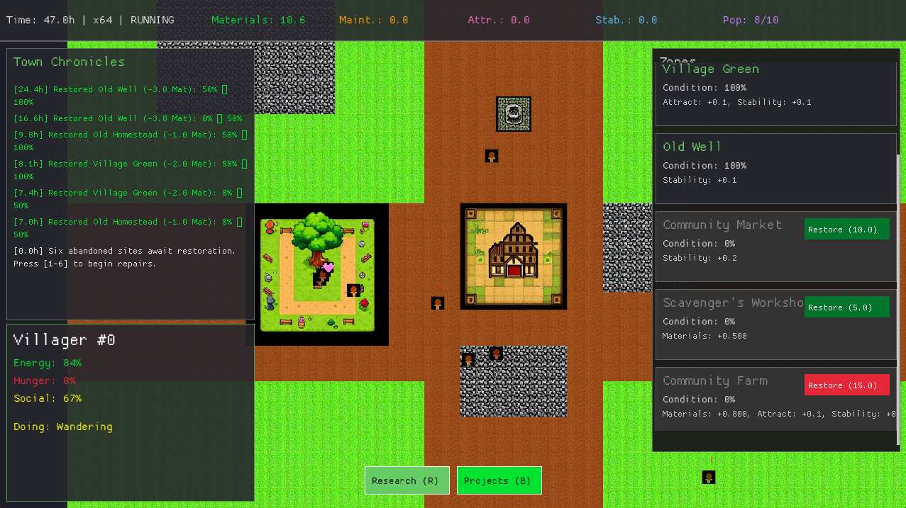

# Quiteville 🏡

**Quiteville** is a relaxing idle town builder where you restore a forgotten settlement, attracting new residents and watching them live their lives. Built with Rust and Macroquad.






## 🌟 Features

*   **Restoration Gameplay**: Start with a map of abandoned ruins and restore them into thriving community centers like the *Old Homestead*, *Village Green*, and *Community Market*.
*   **Living Population**: Watch villagers move in, wander your town, go to work, shop, and socialize. Each villager has their own needs (Hunger, Energy, Social).
*   **Idle Progression**: Your town continues to grow and produce resources even while you are away. Come back to see how things have changed!
*   **Research Tree**: Unlock new technologies to improve production, attractiveness, and housing capacity.
*   **Dynamic Economy**: Balance resources like *Materials*, *Attractiveness*, and *Stability* to keep your town growing.

## 🎮 Controls

| Key / Action | Function |
| :--- | :--- |
| **W, A, S, D** or **Arrows** | Pan Camera |
| **Mouse Wheel** | Zoom In / Out |
| **Left Click** | Select Zone or Villager |
| **B** | Toggle **Projects** (Build) Menu |
| **R** | Toggle **Research** Tree |
| **Space** | Pause / Resume Game |
| **+ / -** | Adjust Game Speed |
| **Esc** | Exit Game |

## 🛠️ Building & Running

Ensure you have [Rust](https://www.rust-lang.org/tools/install) installed.

1.  **Clone the repository**:
    ```bash
    git clone https://github.com/yourusername/quiteville.git
    cd quiteville
    ```

2.  **Run the game**:
    ```bash
    cargo run --release
    ```

## 🏗️ Project Structure

*   `src/main.rs`: Entry point and main game loop.
*   `src/simulation/`: Core game logic (Time, Population, Agents).
*   `src/data/`: Data structures (GameState, Config, Tech Tree).
*   `src/ui/`: User Interface rendering and interaction.
*   `assets/`: JSON configuration files and textures.

## 📝 Credits

Created by the **WebHatchery** team using the [Macroquad](https://macroquad.rs/) game engine.
